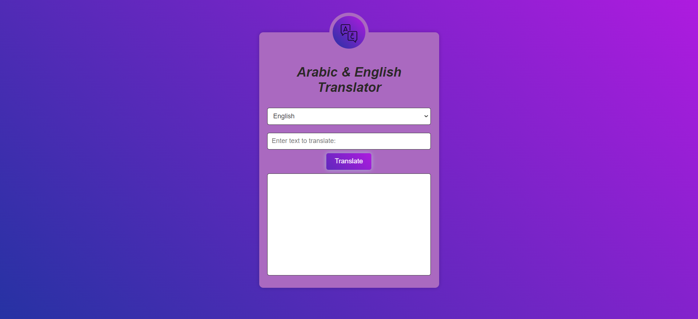

# Translator App
Welcome to the Translator App Project, this is a simple Translator app using API integration and DOM manipulation by **JavaScript**, **HTML**, and **CSS** that translates words from Arabic to English and vice versa and displays GIFs related to the result text.

---
## Description 
The project is implemented with HTML, CSS, and JavaScript. The HTML file (`index.html`) sets up the structure of the Translator app, the CSS file (`style.css`) provides styling to the structure, and the JavaScript file (`main.js`) implements the app's functionality that ensures a comprehensive and user-friendly experience such as: 

1. The user can select the input language (Arabic & English) text He wants to translate it.
2. Users are able to write word or a string in th input field.
3. when The user click on the Translate Button can see the word/text in the other language and a list of GIFs related to this text.
4. A responsive design that looks good on desktop and mobile devices.
5. Input Text Validation to ensure it matches the selected language.

you should be familiar with the following **_technologies_**:
1. HTML
2. CSS
3. JavaScript | DOM Manipulations for manipulation and local storage to store your Search history.
4. API Integration 

---
## Live Demo
You can check out the live demo of the project on <a href="https://qamarsharef27.github.io/TranslationApp/">Live Demo</a>.

---
## Get the Project Locally
To get the project on your local machine, follow these steps:

1. Open a command-line interface **(Terminal)**.
1. **Clone the Repository:** Clone this repository to your local machine using the following command: git clone <https://github.com.qamarSharef27/TranslationApp>
2. **Navigate to the Project Directory:** Change your working directory to the project folder: cd TranslationApp
3. **Run the Application:** Open the `index.html` file in your preferred web browser to interact with the app locally, You can either double-click the index.html file in your file explorer, or you can run the following command in the terminal: open index.html

---

